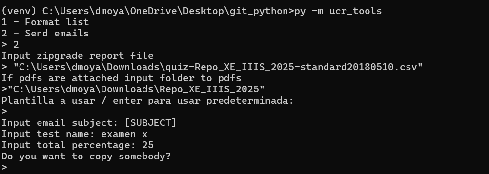

# Utilities for work at UCR

This package includes a set of tools to facilitate work related to administrative task and data analysis

## Email sending
In order to send emails automatically you need to create the following environmental variables

`ucr_email_user`: your email address
`ucr_email_password`: your email password

#### Steps

1 - Download the standard csv file with the zipgrade grades
2 - Download the revised papers within a folder and extract its contents
3 - Run the code using `py -m ucr_tools`
4 - Follow the prompts

## Data analysis

Inside core, there is a module called `data_analysis` which provides some functionalities in order to work with survey data from INEC